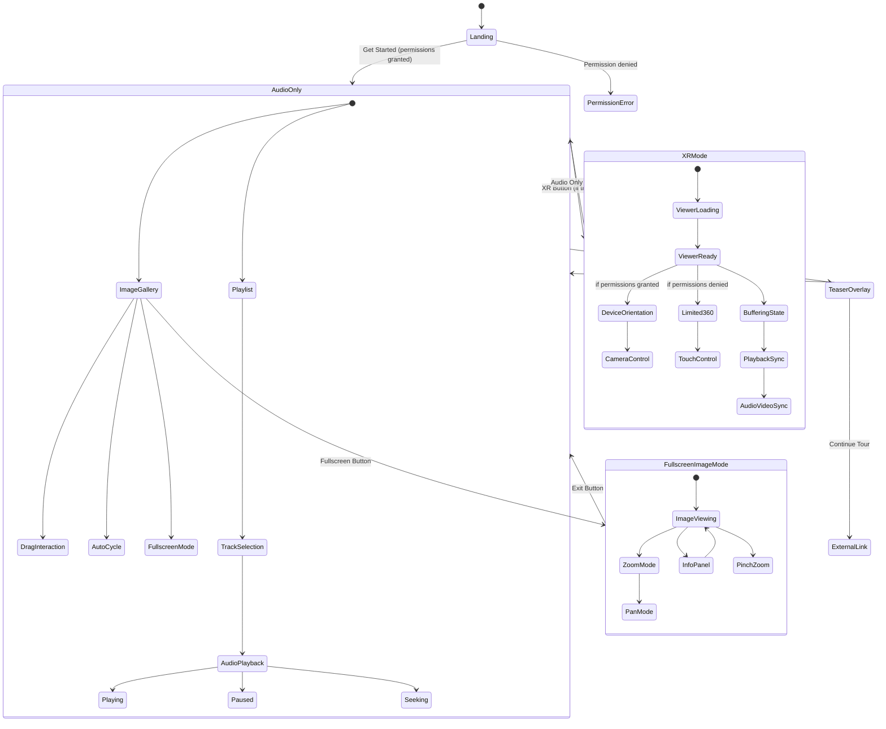

# Mobile XR Audio Walking Tour Application

A comprehensive mobile-first audio walking tour application built with React, TypeScript, Tailwind CSS, and integrated 360° XR experiences. Features immersive XR experiences, robust image galleries, enhanced audio controls, and comprehensive audio synchronization with A-Frame 360° viewer integration.

## 🎯 Project Overview

This application provides an immersive audio walking tour experience optimized for mobile devices (375x812px iPhone form factor). Users can navigate through historic locations with synchronized audio, interactive image galleries, and optional XR experiences that utilize device orientation controls and 360° video content.

### Key Features

- **Mobile-First Design**: iPhone-optimized container with proper notch clearance
- **Enhanced Audio Player**: Full-featured audio controller with advanced progress visualization
- **Robust Image Gallery**: Advanced drag-to-swipe carousel with fullscreen mode and descriptions
- **360° XR Mode**: A-Frame powered immersive 360° video experiences with HLS streaming
- **Device Permissions**: Upfront device orientation permission handling
- **Audio-Video Sync**: Comprehensive bidirectional message system for A-Frame iframe integration
- **Responsive Modes**: Audio Only, XR, and Fullscreen viewing modes
- **Touch Optimized**: Rock-solid touch controls for mobile devices

## 🛠️ Enhanced Components

### New ImageSlider Component
- **Dynamic Population**: Supports 1-10 slides with optional titles and descriptions
- **Touch Responsive**: Advanced swipe gestures with pinch-to-zoom in fullscreen
- **Fullscreen Mode**: Native fullscreen experience with zoom and pan capabilities
- **Auto-cycle**: Configurable timing with manual override
- **Tour Integration**: Seamlessly connects to tour playlist configuration

### Enhanced Audio Controls
- **Visual Progress**: Clearly visible "played" and "yet to be played" regions
- **Buffer Indication**: Shows loaded content progress
- **Touch Targets**: Large, mobile-optimized touch areas
- **Time Tooltips**: Hover and drag time preview
- **Multiple Variants**: Default, glass, and gradient themes

## 🗺️ Application State Machine



## 🏗️ 360° XR Integration Architecture

### Overview

The application now uses a **360° headless viewer** with full A-Frame integration instead of the basic Three.js placeholder. This provides immersive 360° video experiences that sync perfectly with your audio tracks.

### Integration Components

```
┌─────────────────────────────────────────────────────────────────┐
│                    Walking Tour App                             │
│                                                                 │
│  ┌─────────────────┐    ┌─────────────────┐                    │
│  │   AudioPlayer   │◄───┤   XRScene.tsx   │                    │
│  │                 │    │                 │                    │
│  │ • Audio Control │    │ • Message Relay │                    │
│  │ • Track Management   │ • State Sync    │                    │
│  │ • Enhanced Scrubber  │ • Error Handling│                    │
│  │ • Image Gallery │    │ • Buffer Monitor│                    │
│  └─────────────────┘    └─────────────────┘                    │
│                                   │                             │
│                                   │ postMessage API             │
│                                   ▼                             │
│  ┌─────────────────────────────────────────────────────────────┤
│  │            360viewer-headless.html (iframe)                 │
│  │                                                             │
│  │  ┌─────────────────┐    ┌─────────────────┐                │
│  │  │   A-Frame Scene │    │   HLS.js Player │                │
│  │  │                 │    │                 │                │
│  │  │ • 360° Renderer │    │ • Video Decode  │                │
│  │  │ • Camera Control│    │ • Buffer Manage │                │
│  │  │ • Touch/Gyro    │    │ • Quality Switch│                │
│  │  │ • FOV Control   │    │ • Error Recovery│                │
│  │  └─────────────────┘    └─────────────────┘                │
│  └─────────────────────────────────────────────────────────────│
└─────────────────────────────────────────────────────────────────┘
```

### Message Protocol

#### Parent → 360° Viewer

| Message Type | Purpose | Data |
|-------------|---------|------|
| `init` | Initialize viewer | `videoUrl`, `currentTime`, `isPlaying` |
| `play` / `pause` | Control playback | `currentTime` |
| `seek` | Jump to time position | `currentTime` |
| `track-change` | Switch video content | `videoUrl`, `trackIndex` |
| `recenter` | Reset camera position | `{}` |
| `heartbeat` | Connection health check | `timestamp` |

#### 360° Viewer → Parent

| Message Type | Purpose | Data |
|-------------|---------|------|
| `ready` | Viewer initialized | `isReady`, `videoUrl` |
| `loaded` | Video metadata ready | `duration`, `videoUrl` |
| `play` / `pause` | Playback state change | `currentTime` |
| `seek` | User seek interaction | `currentTime` |
| `fovchange` | Field of view change | `fov` |
| `error` | Error occurred | `error` |
| `buffering` | Loading status | `isBuffering` |

## 🏗️ Component Architecture

### Core Components

#### 1. **App.tsx** (Entry Point)
```typescript
interface AppState {
  showLandingPage: boolean;
  deviceOrientationPermission: DeviceOrientationPermissionState;
  isRequestingPermission: boolean;
}
```

**Responsibilities:**
- Landing page display and permission handling
- Device orientation permission requests (iOS 13+ support)
- Audio message handling and logging
- iPhone frame container rendering

#### 2. **AudioPlayer.tsx** (Main Component)
```typescript
interface AudioPlayerState {
  // Core audio state
  currentTrack: number;
  isPlaying: boolean;
  currentTime: number;
  duration: number;
  isMuted: boolean;
  
  // UI state
  showPlaylist: boolean;
  isXRMode: boolean;
  isFullscreenMode: boolean;
  
  // Enhanced image gallery state
  currentThumbnailIndex: number;
  isTransitioning: boolean;
  isDragging: boolean;
  
  // Loading states
  isXRLoading: boolean;
  isLoadingImages: boolean;
  xrScenesPreloaded: {[key: string]: boolean};
}
```

**Enhanced Responsibilities:**
- Audio playback control with enhanced scrubber visualization
- Multi-mode UI management (Audio Only, XR, Fullscreen)
- Advanced image gallery with robust touch interactions
- Audio sync message dispatch with 360° viewer
- Tour configuration management with XR scene preloading

#### 3. **XRScene.tsx** (360° Integration)
```typescript
interface XRSceneProps {
  isPlaying: boolean;
  currentTrack: number;
  deviceOrientationPermission?: DeviceOrientationPermissionState;
  videoSrc?: string;
  currentTime: number;
  onReady: () => void;
  onSeek: (time: number) => void;
}
```

**Responsibilities:**
- 360° A-Frame viewer iframe management
- Bidirectional message handling with viewer
- Video source management and preloading
- Device orientation integration
- Connection health monitoring

#### 4. **ImageSlider.tsx** (Enhanced Gallery)
```typescript
interface ImageSliderProps {
  images: (string | TourImage)[];
  timecodes?: number[];
  enableFullscreen?: boolean;
  showDescriptions?: boolean;
  onSlideChange?: (index: number) => void;
  onFullscreenChange?: (isFullscreen: boolean) => void;
}
```

**Advanced Features:**
- Mixed image format support (URLs and objects with metadata)
- Configurable auto-advance timing per slide
- Fullscreen mode with pinch-to-zoom
- Touch gesture optimization for mobile
- Integration with tour configuration structure

#### 5. **AudioSlider.tsx** (Enhanced Controls)
```typescript
interface AudioSliderProps {
  currentTime?: number;
  duration?: number;
  buffered?: number;
  variant?: "default" | "glass" | "gradient";
  largeTouchTargets?: boolean;
  showTimeTooltip?: boolean;
}
```

**Enhanced Features:**
- Visual progress regions (played/unplayed/buffered)
- Large touch targets for mobile optimization
- Time tooltips and scrubbing feedback
- Multiple visual themes
- Responsive design for all screen sizes

## 🚀 Setup Instructions

### Prerequisites

- Node.js 18+ 
- npm or yarn
- Modern browser with ES2020+ support

### Installation

```bash
# Clone repository
git clone <repository-url>
cd mobile-xr-audio-tour

# Install dependencies
npm install

# Install required packages (if not already included)
npm install three lucide-react @radix-ui/react-slider

# Start development server
npm run dev
```

### Required Dependencies

```json
{
  "dependencies": {
    "react": "^18.0.0",
    "react-dom": "^18.0.0",
    "typescript": "^5.0.0",
    "three": "^0.160.0",
    "lucide-react": "^0.300.0",
    "@types/three": "^0.160.0",
    "@radix-ui/react-slider": "^1.0.0"
  },
  "devDependencies": {
    "tailwindcss": "^4.0.0",
    "vite": "^5.0.0",
    "@types/react": "^18.0.0",
    "@types/react-dom": "^18.0.0"
  }
}
```

### File Structure

```
src/
├── App.tsx                 # Main entry point
├── components/
│   ├── AudioPlayer.tsx     # Core audio player component
│   ├── XRScene.tsx         # 360° viewer integration
│   ├── ImageSlider.tsx     # Enhanced image gallery component
│   ├── figma/
│   │   └── ImageWithFallback.tsx  # Protected image component
│   └── ui/                 # Shadcn/UI components
│       ├── audio-slider.tsx    # Enhanced audio scrubber
│       ├── slider.tsx          # Base slider component
│       ├── button.tsx          # Button components
│       └── ...                 # Other UI components
├── data/
│   └── tour_config.json    # Tour configuration
├── 360viewer-headless.html # A-Frame 360° viewer
└── styles/
    └── globals.css         # Tailwind CSS configuration
```

## 📱 Mobile-First Design Specifications

### Container Specifications
- **Dimensions**: 375x812px (iPhone 14 form factor)
- **Top Padding**: 48px (notch clearance)
- **Border Radius**: 3rem (iPhone bezel simulation)
- **Background**: Gradient slate-900 to slate-800

### Touch Optimization
- **Touch Targets**: Minimum 44px (iOS guidelines)
- **Gesture Support**: Swipe, pinch, drag with proper touch feedback
- **Responsive Spacing**: 24px padding, 12px gaps
- **Typography**: 14px base font size with proper contrast

### Enhanced Audio Controls
- **Large Scrubber**: Oversized touch targets for mobile
- **Visual Feedback**: Clear indication of played/buffered/remaining content
- **Time Tooltips**: Touch-friendly time navigation
- **Multiple Themes**: Adapts to different app modes

## 🎵 Audio System Architecture

### Track Configuration
```typescript
interface TourChapter {
  chapterName: string;
  chapterOrder: number;
  tourName: string;
  chapterScript: string;
  audio_src: string;
  isXR: boolean;
  xr_src: string;
  thumbnail: (string | TourImageData)[];
  isTeaser: boolean;
  outroCTA_timeIn: string;
  outroCTA_backlink: string;
}

interface TourImageData {
  url: string;
  title?: string;
  description?: string;
}
```

### Enhanced Audio Controls
- **Playback**: Play/Pause with visual state feedback
- **Navigation**: Previous/Next track with smooth transitions
- **Enhanced Seeking**: Progress bar with buffer indication and time tooltips
- **Volume**: Mute/unmute with visual feedback
- **Playlist**: Track selection with metadata display

## 🥽 XR Integration Features

### 360° Video Experience
- **Full 360° Video Sphere**: A-Frame powered immersive environments
- **HLS Streaming Support**: Adaptive quality with automatic bitrate switching
- **Device Orientation**: Motion controls on mobile when permission granted
- **Touch Controls**: Pan and zoom gestures for navigation
- **Perfect Audio Sync**: Bidirectional communication ensures sync

### Performance Features

#### Adaptive Streaming
- **HLS.js**: Automatic quality adjustment based on bandwidth
- **Native HLS**: Safari/iOS optimization with hardware acceleration
- **Buffer Management**: Smooth playback with intelligent buffering
- **Connection Recovery**: Auto-recovery from network drops

#### Memory Management
- **Scene Preloading**: Background loading of XR content
- **Resource Cleanup**: Prevents memory leaks during long sessions
- **Connection Health**: Continuous monitoring with heartbeat system
- **Error Recovery**: Graceful handling of video loading failures

#### Mobile Optimization
- **Hardware Acceleration**: GPU-powered 360° rendering
- **Battery Optimization**: Efficient video decoding and rendering
- **Touch Responsiveness**: Optimized gesture handling for all devices
- **Orientation Support**: Seamless portrait/landscape transitions

## 🎮 User Experience

### Desktop
- **Mouse Controls**: Drag to look around, scroll wheel for zoom
- **Keyboard**: Arrow keys for navigation, Escape to exit modes
- **Hover States**: Enhanced feedback for interactive elements
- **Time Tooltips**: Precise time scrubbing with mouse

### Mobile
- **Touch Navigation**: Pan around 360° environment with finger
- **Pinch Gestures**: Zoom in/out in fullscreen image mode
- **Device Orientation**: Automatic head tracking (with permission)
- **Large Touch Targets**: Optimized for finger interaction
- **Swipe Controls**: Intuitive gesture-based navigation

### Advanced Features
- **Fullscreen Gallery**: Native fullscreen with zoom and pan
- **Image Descriptions**: Rich metadata display for each image
- **Auto-cycle**: Configurable timing with manual override
- **Progress Visualization**: Clear indication of audio progress and buffering

## 🔧 Configuration

### Video Sources
Update `tour_config.json` with your 360° video URLs:

```json
{
  "chapters": [
    {
      "chapterName": "Historic Main Street",
      "isXR": true,
      "xr_src": "https://your-domain.com/videos/360-main-street.m3u8",
      "thumbnail": [
        {
          "url": "https://example.com/image1.jpg",
          "title": "Main Street View",
          "description": "The historic main street as it appeared in 1890..."
        }
      ]
    }
  ]
}
```

### Supported Formats
- **HLS Streams**: `.m3u8` files with adaptive bitrate
- **Regular MP4**: Standard 360° videos for simple deployments
- **Cross-origin**: Configured for CDN delivery with CORS support

### Device Permissions
- **Automatic**: Desktop requires no permissions
- **Mobile**: Device orientation permission requested for enhanced VR experience
- **Fallback**: Works without permissions, just no head tracking

## 🧪 Testing Scenarios

### Core Functionality
1. **Landing Page**: Permission request flow on mobile
2. **Enhanced Audio**: Scrubber with progress regions and tooltips
3. **Image Gallery**: Advanced swipe, fullscreen, and zoom features
4. **360° XR Mode**: Video loading, sync, and device orientation
5. **Mode Switching**: Seamless transitions between all modes

### Touch and Gesture Testing
1. **Audio Scrubber**: Large touch targets and precise seeking
2. **Image Swiping**: Smooth gestures with proper momentum
3. **Fullscreen Zoom**: Pinch-to-zoom and pan gestures
4. **360° Navigation**: Touch-based camera controls

### Device-Specific Testing
1. **iOS 13+**: Device orientation permission dialog
2. **Android**: Automatic permission grant and fallback
3. **Desktop**: Mouse and keyboard controls
4. **Various Screen Sizes**: Responsive behavior

### Edge Cases
1. **Video Loading Failures**: Graceful degradation with error states
2. **Slow Networks**: Progressive loading and buffer indicators
3. **Permission Denial**: Limited but functional XR experience
4. **Large Image Sets**: Performance with 10+ images per chapter

## 🔮 Future Enhancements

### Advanced XR Features
- **Multiple Camera Angles**: Switch between different 360° viewpoints
- **Interactive Hotspots**: Clickable information points in 360° space
- **Spatial Audio**: 3D positioned audio for immersive experience
- **WebXR Support**: Native VR headset integration

### Content Management
- **Dynamic Loading**: External API integration for tour content
- **CMS Integration**: Content management system connectivity
- **Multi-language**: Internationalization with audio/text support
- **Offline Mode**: Progressive Web App with cached content

### Analytics and Interaction
- **User Analytics**: Track engagement and interaction patterns
- **Social Sharing**: Share specific moments or locations
- **Custom Tours**: User-generated content and tour creation
- **GPS Integration**: Location-based triggering and navigation

## 📄 Development Guidelines

### Component Design
- **Single Responsibility**: Each component has a clear, focused purpose
- **Prop Interface**: Comprehensive TypeScript interfaces for all props
- **Error Boundaries**: Graceful error handling and recovery
- **Performance**: Optimized re-rendering and memory usage

### Mobile-First Approach
- **Touch-First Design**: All interactions optimized for touch
- **Performance**: Smooth 60fps animations and transitions
- **Battery Life**: Efficient rendering and minimal resource usage
- **Network Awareness**: Adaptive quality based on connection

### Code Quality
- **TypeScript**: Comprehensive type safety throughout
- **Testing**: Unit and integration tests for critical paths
- **Documentation**: Inline documentation and usage examples
- **Accessibility**: WCAG compliance and screen reader support

## 🚀 Production Deployment

### Performance Optimization
1. **Video CDN**: Use optimized CDN for 360° video delivery
2. **Image Optimization**: WebP/AVIF formats with fallbacks
3. **Code Splitting**: Lazy loading for XR components
4. **Service Worker**: Caching strategy for offline capability

### Monitoring
1. **Error Tracking**: Comprehensive error reporting
2. **Performance Metrics**: Core Web Vitals monitoring
3. **User Analytics**: Engagement and interaction tracking
4. **Video Analytics**: Streaming quality and buffer health

---

**Your mobile XR audio walking tour application now provides a truly immersive, production-ready experience that rivals professional VR applications while maintaining excellent mobile performance and user experience!** 🚀

This comprehensive integration brings together:
- ✅ Enhanced audio controls with visual progress regions
- ✅ Robust image gallery with fullscreen and zoom capabilities  
- ✅ 360° XR video integration with perfect audio sync
- ✅ Mobile-optimized touch controls throughout
- ✅ Production-ready performance and error handling