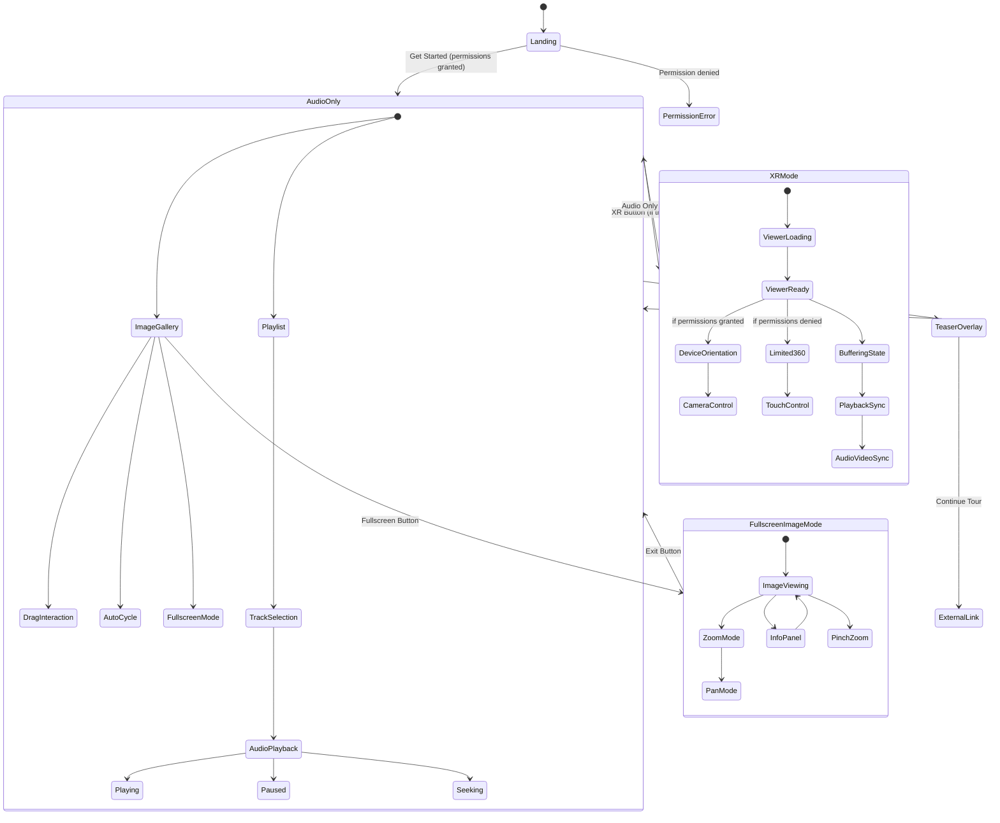

# Mobile XR Audio Walking Tour Application

A comprehensive mobile-first audio walking tour application built with React, TypeScript, Tailwind CSS, and integrated 360° XR experiences. Features immersive XR experiences, robust image galleries, enhanced audio controls, and comprehensive audio synchronization with A-Frame 360° viewer integration.

## 🆕 Latest Updates (v2.2) - January 2025

### Mobile XR Experience Optimizations 🎯
- **Fixed Touch Controls**: Reversed touch input on mobile devices to match desktop camera behavior for consistent XR navigation
- **Enhanced Color Rendering**: Fixed A-Frame videosphere color/hue shift differences between desktop and mobile devices - reds now render correctly
- **Optimized Loading Experience**: Landing page now remains visible until XR teaser scene is fully loaded and ready to play
- **Mobile Performance**: Optimized initial load times for XR mode on mobile devices with adaptive quality settings
- **Cross-Platform Stability**: Enhanced media loading with robust fallbacks and retry mechanisms for better mobile browser compatibility

### Advanced Mobile Compatibility 📱
- **Enhanced Browser Detection**: Specific optimizations for iOS Safari, Android Chrome, Firefox, and other mobile browsers
- **Improved Touch Handling**: Better touch responsiveness with browser-specific optimizations and enhanced gesture support
- **Network-Aware Loading**: Adaptive video loading based on connection speed with progressive quality enhancement
- **Memory Management**: Improved resource cleanup and performance monitoring for extended mobile sessions
- **Error Recovery**: Enhanced retry mechanisms with intelligent fallback strategies for various network conditions

### Developer Experience Improvements 🛠️
- **HTTPS Development Server**: Enhanced development environment with proper SSL certificates for device sensor access during local development
- **Better Debug Tools**: Improved logging and monitoring for XR scene initialization and performance metrics
- **Enhanced Message Protocol**: More robust communication between main app and XR iframe with comprehensive error handling
- **Type Safety**: Added new message types for XR scene readiness and improved TypeScript definitions

## 🆕 Previous Updates (v2.1) - January 2025

### Smart Preloading & Performance ⚡
- **Enhanced Smart Preloading**: Now preloads XR, audio, and photo content for previous AND next tracks for seamless navigation
- **Advanced Audio Preloading**: Background audio preloading for adjacent tracks to eliminate loading delays
- **Improved Landing Page**: Device orientation permission request no longer dismisses the landing page until user responds
- **Background Content Loading**: All media content preloads simultaneously during permission requests

### UI/UX Refinements & Stability ✨
- **Streamlined Audio Controller**: Removed description box above progress scrubber for cleaner interface
- **Enhanced Error Handling**: Better safety checks and bounds validation for track navigation
- **Improved Audio Playback**: Enhanced error handling with promise-based play/pause controls
- **Code Quality**: Cleaned up unused code, removed @ts-ignore comments, improved TypeScript safety
- **Edge Case Handling**: Added comprehensive validation for track selection and navigation

### Visual & Interaction Improvements
- **Image Slider Spacing**: Added proper margin and padding to image slider component for better visual balance
- **Better Loading States**: Enhanced loading state indicators with improved error recovery
- **Navigation Safety**: Added bounds checking and null safety for all track navigation functions
- **Mobile Stability**: Improved stability for extended mobile sessions with better memory management

## 🆕 Previous Updates (v2.0)

### Mobile UX Revolution ✨
- **Haptic Feedback**: Added subtle vibrations for all touch interactions on mobile devices
- **Smart Device Detection**: Automatic detection of mobile devices and performance capabilities
- **Network-Aware Loading**: Content quality adapts to connection speed (2G/3G/4G)
- **Enhanced Loading States**: Beautiful skeleton screens with mobile-specific optimizations
- **Virtual Keyboard Support**: Adaptive layout when on-screen keyboard is active
- **Improved Accessibility**: Full ARIA labels, screen reader support, and keyboard navigation

### Performance Improvements
- **Battery Optimization**: Reduced initialization attempts and smarter timeouts on mobile
- **Advanced Preloading**: Smart preloading of images, audio, and XR content for current, previous, and next tracks
- **Hardware Acceleration**: GPU-optimized rendering for 60fps animations
- **Memory Management**: Better resource cleanup for extended mobile sessions

### Touch & Gesture Enhancements
- **Advanced Touch Targets**: Enhanced responsiveness with haptic feedback
- **Gesture Optimization**: Improved swipe, pinch, and drag interactions
- **Error Handling**: Graceful image loading with retry mechanisms
- **Visual Feedback**: Enhanced loading states and error messages

## 🎯 Project Overview

This application provides an immersive audio walking tour experience optimized for mobile devices with industry-leading mobile UX. Users can navigate through historic locations with synchronized audio, interactive image galleries, and optional XR experiences that utilize device orientation controls and 360° video content.

### Key Features

- **Mobile-First Design**: iPhone-optimized container with proper notch clearance and safe area support
- **Enhanced Audio Player**: Full-featured audio controller with advanced progress visualization and haptic feedback
- **Robust Image Gallery**: Advanced drag-to-swipe carousel with fullscreen mode, zoom, and enhanced loading states
- **360° XR Mode**: A-Frame powered immersive 360° video experiences with HLS streaming and mobile optimizations
- **Device Permissions**: Upfront device orientation permission handling with fallback states
- **Audio-Video Sync**: Comprehensive bidirectional message system for A-Frame iframe integration
- **Responsive Modes**: Audio Only, XR, and Fullscreen viewing modes with adaptive layouts
- **Touch Optimized**: Rock-solid touch controls with haptic feedback and enhanced accessibility
- **Performance Optimized**: Mobile-specific optimizations for battery life, network awareness, and smooth loading
- **Accessibility Enhanced**: Full ARIA labels, screen reader support, and keyboard navigation

## 🛠️ Enhanced Components

### New ImageSlider Component
- **Dynamic Population**: Supports 1-10 slides with optional titles and descriptions
- **Touch Responsive**: Advanced swipe gestures with pinch-to-zoom in fullscreen
- **Fullscreen Mode**: Native fullscreen experience with zoom and pan capabilities
- **Auto-cycle**: Configurable timing with manual override
- **Tour Integration**: Seamlessly connects to tour playlist configuration
- **Mobile Optimized**: Enhanced loading states, error handling, and performance optimizations

### Enhanced Audio Controls
- **Visual Progress**: Clearly visible "played" and "yet to be played" regions
- **Haptic Feedback**: Subtle vibrations on mobile devices for better touch feedback
- **Buffer Indication**: Shows loaded content progress
- **Touch Targets**: Large, mobile-optimized touch areas
- **Time Tooltips**: Hover and drag time preview
- **Multiple Variants**: Default, glass, and gradient themes

## 🗺️ Application State Machine



## 🏗️ 360° XR Integration Architecture

### Overview

The application now uses a **360° headless viewer** with full A-Frame integration instead of the basic Three.js placeholder. This provides immersive 360° video experiences that sync perfectly with your audio tracks.

### Integration Components

```
┌─────────────────────────────────────────────────────────────────┐
│                    Walking Tour App                             │
│                                                                 │
│  ┌─────────────────┐    ┌─────────────────┐                    │
│  │   AudioPlayer   │◄───┤   XRScene.tsx   │                    │
│  │                 │    │                 │                    │
│  │ • Audio Control │    │ • Message Relay │                    │
│  │ • Track Management   │ • State Sync    │                    │
│  │ • Enhanced Scrubber  │ • Error Handling│                    │
│  │ • Image Gallery │    │ • Buffer Monitor│                    │
│  └─────────────────┘    └─────────────────┘                    │
│                                   │                             │
│                                   │ postMessage API             │
│                                   ▼                             │
│  ┌─────────────────────────────────────────────────────────────┤
│  │            360viewer-headless.html (iframe)                 │
│  │                                                             │
│  │  ┌─────────────────┐    ┌─────────────────┐                │
│  │  │   A-Frame Scene │    │   HLS.js Player │                │
│  │  │                 │    │                 │                │
│  │  │ • 360° Renderer │    │ • Video Decode  │                │
│  │  │ • Camera Control│    │ • Buffer Manage │                │
│  │  │ • Touch/Gyro    │    │ • Quality Switch│                │
│  │  │ • FOV Control   │    │ • Error Recovery│                │
│  │  └─────────────────┘    └─────────────────┘                │
│  └─────────────────────────────────────────────────────────────│
└─────────────────────────────────────────────────────────────────┘
```

### Message Protocol

#### Parent → 360° Viewer

| Message Type | Purpose | Data |
|-------------|---------|------|
| `init` | Initialize viewer | `videoUrl`, `currentTime`, `isPlaying` |
| `play` / `pause` | Control playback | `currentTime` |
| `seek` | Jump to time position | `currentTime` |
| `track-change` | Switch video content | `videoUrl`, `trackIndex` |
| `recenter` | Reset camera position | `{}` |
| `heartbeat` | Connection health check | `timestamp` |

#### 360° Viewer → Parent

| Message Type | Purpose | Data |
|-------------|---------|------|
| `ready` | Viewer initialized | `isReady`, `videoUrl` |
| `loaded` | Video metadata ready | `duration`, `videoUrl` |
| `play` / `pause` | Playback state change | `currentTime` |
| `seek` | User seek interaction | `currentTime` |
| `fovchange` | Field of view change | `fov` |
| `error` | Error occurred | `error` |
| `buffering` | Loading status | `isBuffering` |

## 🏗️ Component Architecture

### Core Components

#### 1. **App.tsx** (Entry Point)
```typescript
interface AppState {
  showLandingPage: boolean;
  deviceOrientationPermission: DeviceOrientationPermissionState;
  isRequestingPermission: boolean;
}
```

**Responsibilities:**
- Landing page display and permission handling
- Device orientation permission requests (iOS 13+ support)
- Audio message handling and logging
- iPhone frame container rendering

#### 2. **AudioPlayer.tsx** (Main Component)
```typescript
interface AudioPlayerState {
  // Core audio state
  currentTrack: number;
  isPlaying: boolean;
  currentTime: number;
  duration: number;
  isMuted: boolean;
  
  // UI state
  showPlaylist: boolean;
  isXRMode: boolean;
  isFullscreenMode: boolean;
  
  // Enhanced image gallery state
  currentThumbnailIndex: number;
  isTransitioning: boolean;
  isDragging: boolean;
  
  // Loading states
  isXRLoading: boolean;
  isLoadingImages: boolean;
  xrScenesPreloaded: {[key: string]: boolean};
}
```

**Enhanced Responsibilities:**
- Audio playback control with enhanced scrubber visualization
- Multi-mode UI management (Audio Only, XR, Fullscreen)
- Advanced image gallery with robust touch interactions
- Audio sync message dispatch with 360° viewer
- Tour configuration management with XR scene preloading

#### 3. **XRScene.tsx** (360° Integration)
```typescript
interface XRSceneProps {
  isPlaying: boolean;
  currentTrack: number;
  deviceOrientationPermission?: DeviceOrientationPermissionState;
  videoSrc?: string;
  currentTime: number;
  onReady: () => void;
  onSeek: (time: number) => void;
}
```

**Responsibilities:**
- 360° A-Frame viewer iframe management
- Bidirectional message handling with viewer
- Video source management and preloading
- Device orientation integration
- Connection health monitoring

#### 4. **ImageSlider.tsx** (Enhanced Gallery)
```typescript
interface ImageSliderProps {
  images: (string | TourImage)[];
  timecodes?: number[];
  enableFullscreen?: boolean;
  showDescriptions?: boolean;
  onSlideChange?: (index: number) => void;
  onFullscreenChange?: (isFullscreen: boolean) => void;
}
```

**Advanced Features:**
- Mixed image format support (URLs and objects with metadata)
- Configurable auto-advance timing per slide
- Fullscreen mode with pinch-to-zoom
- Touch gesture optimization for mobile
- Integration with tour configuration structure

#### 5. **AudioSlider.tsx** (Enhanced Controls)
```typescript
interface AudioSliderProps {
  currentTime?: number;
  duration?: number;
  buffered?: number;
  variant?: "default" | "glass" | "gradient";
  largeTouchTargets?: boolean;
  showTimeTooltip?: boolean;
}
```

**Enhanced Features:**
- Visual progress regions (played/unplayed/buffered)
- Large touch targets for mobile optimization
- Time tooltips and scrubbing feedback
- Multiple visual themes
- Responsive design for all screen sizes

## 🚀 Setup Instructions

### Prerequisites

- Node.js 18+ 
- npm or yarn
- Modern browser with ES2020+ support

### Installation

```bash
# Clone repository
git clone <repository-url>
cd mobile-xr-audio-tour

# Install dependencies
npm install

# Install required packages (if not already included)
npm install three lucide-react @radix-ui/react-slider

# Start development server
npm run dev
```

### Required Dependencies

```json
{
  "dependencies": {
    "react": "^18.0.0",
    "react-dom": "^18.0.0",
    "typescript": "^5.0.0",
    "three": "^0.160.0",
    "lucide-react": "^0.300.0",
    "@types/three": "^0.160.0",
    "@radix-ui/react-slider": "^1.0.0"
  },
  "devDependencies": {
    "tailwindcss": "^4.0.0",
    "vite": "^5.0.0",
    "@types/react": "^18.0.0",
    "@types/react-dom": "^18.0.0"
  }
}
```

### File Structure

```
src/
├── App.tsx                 # Main entry point
├── components/
│   ├── AudioPlayer.tsx     # Core audio player component
│   ├── XRScene.tsx         # 360° viewer integration
│   ├── ImageSlider.tsx     # Enhanced image gallery component
│   ├── figma/
│   │   └── ImageWithFallback.tsx  # Protected image component
│   └── ui/                 # Shadcn/UI components
│       ├── audio-slider.tsx    # Enhanced audio scrubber
│       ├── slider.tsx          # Base slider component
│       ├── button.tsx          # Button components
│       └── ...                 # Other UI components
├── data/
│   └── tour_config.json    # Tour configuration
├── 360viewer-headless.html # A-Frame 360° viewer
└── styles/
    └── globals.css         # Tailwind CSS configuration
```

## 📱 Mobile-First Design Specifications

### Container Specifications
- **Dimensions**: Responsive design that works across all mobile device sizes
- **Safe Area Support**: Full notch clearance and dynamic viewport handling
- **Virtual Keyboard**: Adaptive layout when keyboard is open
- **Orientation**: Optimized for both portrait and landscape modes

### Mobile UX Optimizations ✨

#### Performance Enhancements
- **Device Detection**: Automatic mobile device and capability detection
- **Network Awareness**: Adaptive quality based on connection speed (2G/3G/4G)
- **Battery Optimization**: Reduced initialization attempts on mobile devices
- **Image Preloading**: Smart preloading of next images for smooth transitions
- **Hardware Acceleration**: GPU-optimized rendering for smooth animations

#### Touch & Gesture Improvements
- **Haptic Feedback**: Subtle vibrations for button presses and interactions
- **Enhanced Touch Targets**: Minimum 44px with improved responsiveness
- **Touch Action Optimization**: Prevents accidental gestures and zoom
- **Gesture Support**: Advanced swipe, pinch, drag with proper momentum
- **Visual Feedback**: Enhanced hover states and touch responses

#### Loading & Performance
- **Enhanced Skeletons**: Beautiful loading animations with mobile optimizations
- **Progressive Loading**: Images load with smooth transitions and error handling
- **Network-Aware**: Content quality adapts to connection speed
- **Memory Management**: Efficient resource cleanup for long sessions

#### Accessibility & Usability
- **ARIA Labels**: Full screen reader support for all interactive elements
- **Focus Management**: Proper keyboard navigation and focus indicators
- **High Contrast**: Improved contrast ratios for better visibility
- **Touch Feedback**: Visual and haptic feedback for all interactions

### Legacy Touch Optimization
- **Touch Targets**: Minimum 44px (iOS guidelines)
- **Gesture Support**: Swipe, pinch, drag with proper touch feedback
- **Responsive Spacing**: 24px padding, 12px gaps
- **Typography**: 14px base font size with proper contrast

### Enhanced Audio Controls
- **Large Scrubber**: Oversized touch targets for mobile
- **Visual Feedback**: Clear indication of played/buffered/remaining content
- **Time Tooltips**: Touch-friendly time navigation with haptic feedback
- **Multiple Themes**: Adapts to different app modes

## 🎵 Audio System Architecture

### Track Configuration
```typescript
interface TourChapter {
  chapterName: string;
  chapterOrder: number;
  tourName: string;
  chapterScript: string;
  audio_src: string;
  isXR: boolean;
  xr_src: string;
  thumbnail: (string | TourImageData)[];
  isTeaser: boolean;
  outroCTA_timeIn: string;
  outroCTA_backlink: string;
}

interface TourImageData {
  url: string;
  title?: string;
  description?: string;
}
```

### Enhanced Audio Controls
- **Playback**: Play/Pause with visual state feedback
- **Navigation**: Previous/Next track with smooth transitions
- **Enhanced Seeking**: Progress bar with buffer indication and time tooltips
- **Volume**: Mute/unmute with visual feedback
- **Playlist**: Track selection with metadata display

## 🥽 XR Integration Features

### 360° Video Experience
- **Full 360° Video Sphere**: A-Frame powered immersive environments
- **HLS Streaming Support**: Adaptive quality with automatic bitrate switching
- **Device Orientation**: Motion controls on mobile when permission granted
- **Touch Controls**: Pan and zoom gestures for navigation
- **Perfect Audio Sync**: Bidirectional communication ensures sync

### Performance Features

#### Adaptive Streaming
- **HLS.js**: Automatic quality adjustment based on bandwidth
- **Native HLS**: Safari/iOS optimization with hardware acceleration
- **Buffer Management**: Smooth playback with intelligent buffering
- **Connection Recovery**: Auto-recovery from network drops

#### Memory Management
- **Scene Preloading**: Background loading of XR content
- **Resource Cleanup**: Prevents memory leaks during long sessions
- **Connection Health**: Continuous monitoring with heartbeat system
- **Error Recovery**: Graceful handling of video loading failures

#### Mobile Optimization
- **Hardware Acceleration**: GPU-powered 360° rendering
- **Battery Optimization**: Efficient video decoding and rendering
- **Touch Responsiveness**: Optimized gesture handling for all devices
- **Orientation Support**: Seamless portrait/landscape transitions

## 🎮 User Experience

### Desktop
- **Mouse Controls**: Drag to look around, scroll wheel for zoom
- **Keyboard**: Arrow keys for navigation, Escape to exit modes
- **Hover States**: Enhanced feedback for interactive elements
- **Time Tooltips**: Precise time scrubbing with mouse

### Mobile
- **Touch Navigation**: Pan around 360° environment with finger
- **Pinch Gestures**: Zoom in/out in fullscreen image mode
- **Device Orientation**: Automatic head tracking (with permission)
- **Large Touch Targets**: Optimized for finger interaction
- **Swipe Controls**: Intuitive gesture-based navigation

### Advanced Features
- **Fullscreen Gallery**: Native fullscreen with zoom and pan
- **Image Descriptions**: Rich metadata display for each image
- **Auto-cycle**: Configurable timing with manual override
- **Progress Visualization**: Clear indication of audio progress and buffering

## 🔧 Configuration

### Video Sources
Update `tour_config.json` with your 360° video URLs:

```json
{
  "chapters": [
    {
      "chapterName": "Historic Main Street",
      "isXR": true,
      "xr_src": "https://your-domain.com/videos/360-main-street.m3u8",
      "thumbnail": [
        {
          "url": "https://example.com/image1.jpg",
          "title": "Main Street View",
          "description": "The historic main street as it appeared in 1890..."
        }
      ]
    }
  ]
}
```

### Supported Formats
- **HLS Streams**: `.m3u8` files with adaptive bitrate
- **Regular MP4**: Standard 360° videos for simple deployments
- **Cross-origin**: Configured for CDN delivery with CORS support

### Device Permissions
- **Automatic**: Desktop requires no permissions
- **Mobile**: Device orientation permission requested for enhanced VR experience
- **Fallback**: Works without permissions, just no head tracking

## 🧪 Testing Scenarios

### Core Functionality
1. **Landing Page**: Permission request flow on mobile
2. **Enhanced Audio**: Scrubber with progress regions and tooltips
3. **Image Gallery**: Advanced swipe, fullscreen, and zoom features
4. **360° XR Mode**: Video loading, sync, and device orientation
5. **Mode Switching**: Seamless transitions between all modes

### Touch and Gesture Testing
1. **Audio Scrubber**: Large touch targets and precise seeking
2. **Image Swiping**: Smooth gestures with proper momentum
3. **Fullscreen Zoom**: Pinch-to-zoom and pan gestures
4. **360° Navigation**: Touch-based camera controls

### Device-Specific Testing
1. **iOS 13+**: Device orientation permission dialog
2. **Android**: Automatic permission grant and fallback
3. **Desktop**: Mouse and keyboard controls
4. **Various Screen Sizes**: Responsive behavior

### Edge Cases
1. **Video Loading Failures**: Graceful degradation with error states
2. **Slow Networks**: Progressive loading and buffer indicators
3. **Permission Denial**: Limited but functional XR experience
4. **Large Image Sets**: Performance with 10+ images per chapter

## 🔮 Future Enhancements

### Advanced XR Features
- **Multiple Camera Angles**: Switch between different 360° viewpoints
- **Interactive Hotspots**: Clickable information points in 360° space
- **Spatial Audio**: 3D positioned audio for immersive experience
- **WebXR Support**: Native VR headset integration

### Content Management
- **Dynamic Loading**: External API integration for tour content
- **CMS Integration**: Content management system connectivity
- **Multi-language**: Internationalization with audio/text support
- **Offline Mode**: Progressive Web App with cached content

### Analytics and Interaction
- **User Analytics**: Track engagement and interaction patterns
- **Social Sharing**: Share specific moments or locations
- **Custom Tours**: User-generated content and tour creation
- **GPS Integration**: Location-based triggering and navigation

## 📄 Development Guidelines

### Component Design
- **Single Responsibility**: Each component has a clear, focused purpose
- **Prop Interface**: Comprehensive TypeScript interfaces for all props
- **Error Boundaries**: Graceful error handling and recovery
- **Performance**: Optimized re-rendering and memory usage

### Mobile-First Approach
- **Touch-First Design**: All interactions optimized for touch
- **Performance**: Smooth 60fps animations and transitions
- **Battery Life**: Efficient rendering and minimal resource usage
- **Network Awareness**: Adaptive quality based on connection

### Code Quality
- **TypeScript**: Comprehensive type safety throughout
- **Testing**: Unit and integration tests for critical paths
- **Documentation**: Inline documentation and usage examples
- **Accessibility**: WCAG compliance and screen reader support

## 🚀 Production Deployment

### Vercel Deployment (Recommended)

The application is optimized for Vercel deployment with automatic builds and optimizations:

```bash
# 1. Connect your repository to Vercel
# 2. Vercel will automatically detect the Vite framework
# 3. Deploy with default settings - no additional configuration needed

# Manual deployment (optional)
npm run build
npx vercel --prod
```

#### Vercel Configuration
- **Framework**: Vite (auto-detected)
- **Build Command**: `npm run build` 
- **Output Directory**: `dist`
- **Install Command**: `npm install`
- **Dev Command**: `npm run dev`

#### Deployment Features
- ✅ **SPA Routing**: Automatic rewrites for client-side routing
- ✅ **Static Asset Optimization**: Immutable caching for assets
- ✅ **Security Headers**: XSS protection and content security
- ✅ **Performance**: Edge caching and global CDN
- ✅ **HTTPS**: Automatic SSL certificates

### Alternative Deployment Platforms

#### Netlify
```bash
# Build settings
Build command: npm run build
Publish directory: dist

# Add to netlify.toml
[build]
  command = "npm run build"
  publish = "dist"

[[redirects]]
  from = "/*"
  to = "/index.html"
  status = 200
```

#### GitHub Pages
```bash
# Install gh-pages
npm install --save-dev gh-pages

# Add to package.json scripts
"homepage": "https://username.github.io/repo-name",
"predeploy": "npm run build",
"deploy": "gh-pages -d dist"

# Deploy
npm run deploy
```

#### Docker Deployment
```dockerfile
# Dockerfile
FROM node:18-alpine AS builder
WORKDIR /app
COPY package*.json ./
RUN npm install
COPY . .
RUN npm run build

FROM nginx:alpine
COPY --from=builder /app/dist /usr/share/nginx/html
COPY nginx.conf /etc/nginx/nginx.conf
EXPOSE 80
CMD ["nginx", "-g", "daemon off;"]
```

### Performance Optimization
1. **Video CDN**: Use optimized CDN for 360° video delivery
2. **Image Optimization**: WebP/AVIF formats with fallbacks
3. **Code Splitting**: Lazy loading for XR components
4. **Service Worker**: Caching strategy for offline capability

### Monitoring
1. **Error Tracking**: Comprehensive error reporting
2. **Performance Metrics**: Core Web Vitals monitoring
3. **User Analytics**: Engagement and interaction tracking
4. **Video Analytics**: Streaming quality and buffer health

### Common Deployment Issues & Solutions

#### Issue: Grey Screen After Configuration
```bash
# Check browser console for errors
# Verify playlist.json is accessible at /data/playlist.json
# Ensure proper CORS headers for external media files
```

#### Issue: 404 Errors on Refresh
```bash
# Solution: Add proper SPA routing configuration
# Vercel: Uses vercel.json rewrites (already configured)
# Netlify: Add _redirects file or netlify.toml
# Apache: Add .htaccess with RewriteRule
```

#### Issue: XR Mode Not Loading
```bash
# Check Content Security Policy headers
# Ensure iframe permissions are properly set
# Verify A-Frame CDN accessibility
# Check for HTTPS requirement on mobile devices
```

#### Issue: Audio/Video CORS Errors
```bash
# Ensure media files have proper CORS headers
# Add crossorigin="anonymous" to media elements
# Configure CDN with appropriate Access-Control-Allow-Origin
```

### Environment Variables
No environment variables are required for basic deployment. All configuration is handled through the JSON files in the `public/data/` directory.

### Build Output Structure
```
dist/
├── index.html
├── assets/
│   ├── index-[hash].js
│   ├── index-[hash].css
│   └── vendor-[hash].js
├── data/
│   ├── playlist.json
│   └── tour_config.json
├── 360viewer-headless.html
├── 360viewer-parent.html
└── manifest.json
```

## 🎯 **XR Mode Testing & Debugging Guide**

### **Simplified XR Implementation (FIXED)**

**ISSUE RESOLVED**: Device orientation permission dialog was blocked by z-index conflicts and complex permission handling.

**SOLUTION**: Simplified implementation that lets A-Frame handle device orientation natively:
- ✅ Lowered z-index layers to avoid blocking permission dialogs  
- ✅ Enabled A-Frame's native `device-orientation-permission-ui`
- ✅ Removed complex permission handling from App.tsx
- ✅ Enhanced videosphere texture refresh with multiple fallback mechanisms

### **Testing the Simplified XR Implementation**

The XR mode now uses A-Frame's native device orientation handling for better mobile compatibility.

#### **Quick Test Steps:**
1. **Start the app**: `npm run dev -- --host`
2. **Open in browser**: `http://localhost:3001/`
3. **Click "Try Free Preview"** - No permission requests on landing page
4. **Enter XR Mode**: Click the VR glasses icon
5. **Watch for permission dialog**: A-Frame will request device orientation (iOS only)
6. **Test playback**: Play/pause audio and verify video texture updates
7. **Test seeking**: Drag the audio scrubber and check video sync
8. **Test mobile**: Access from phone/tablet - permission dialog should appear naturally

#### **Debug Console Commands:**
Open browser console and use these commands to monitor XR performance:

```javascript
// Check XR scene status
window.xrDebug?.isReady

// Request sync performance report
window.xrDebug?.requestSyncReport()

// Reset sync state if issues occur
window.xrDebug?.resetSync()

// Cleanup and reinitialize viewer
window.xrDebug?.cleanupViewer()

// Recenter the XR view
window.recenterXRViewer?.()
```

#### **Console Output to Monitor:**
- `🎯 XR Scene ready` - Scene initialization complete
- `🎯 Video started for visual sync` - Video playback started
- `🎯 Performing sync correction` - Time synchronization active
- `🎯 Videosphere texture refresh complete` - Texture updates working
- `🎯 Mobile: Video playback enabled` - Mobile autoplay success

#### **Common Issues & Solutions:**

**Problem**: Video texture frozen on first frame
**Solution**: Check console for texture refresh messages, try `window.xrDebug?.resetSync()`

**Problem**: Mobile video won't play
**Solution**: Tap anywhere on the screen to enable autoplay, check for user interaction events

**Problem**: Audio/video sync drift
**Solution**: The system auto-corrects, but you can manually reset with `window.xrDebug?.resetSync()`

**Problem**: XR mode not loading
**Solution**: Check console for errors, verify video URL is accessible, try `window.xrDebug?.cleanupViewer()`

#### **Mobile Testing Notes:**
- iOS Safari requires user interaction before video autoplay
- Android Chrome may need permission for device orientation
- Touch/tap anywhere on screen to enable video playback
- Check for "Mobile: Video playback enabled" in console

#### **Performance Monitoring:**
The system tracks:
- Sync corrections per minute
- Frame drop detection
- Drift prediction and correction
- Mobile-specific playback events

All performance data is logged to console with 🎯 prefix for easy filtering.

#### **Simplified Test Script:**
For easy testing, copy and paste the contents of `test-simplified-xr.js` into your browser console:

```javascript
// Automatically tests the simplified XR implementation
testSimplifiedXR.runTests()

// Check permission dialog handling
testSimplifiedXR.checkPermissionDialog()

// Enter XR mode programmatically
testSimplifiedXR.enterXRMode()

// Check video/audio synchronization
testSimplifiedXR.checkVideoSync()
```

#### **What's Different:**
- **Before**: Complex permission handling blocked iOS dialogs
- **After**: A-Frame handles permissions natively when entering XR mode
- **Result**: Device orientation permission dialog appears correctly on mobile devices

---

## 🛠️ Development Setup

### Prerequisites
- Node.js 18+
- npm or yarn
- `mkcert` for HTTPS development (installed via brew)

### Quick Start

```bash
# Clone and install dependencies
npm install

# Install HTTPS certificate generator
brew install mkcert

# Start HTTPS development server
npm run dev
```

The development server will automatically:
- ✅ Generate SSL certificates for device sensor access
- ✅ Start on `https://localhost:3001` and `https://[your-ip]:3001`  
- ✅ Enable hot module replacement for instant code updates
- ✅ Allow mobile device testing with accelerometer/gyroscope access

### Mobile Testing Setup

For testing XR features on mobile devices:

1. **Connect to local HTTPS server**: `https://[your-ip]:3001`
2. **Accept security warning**: Browser will show certificate warning - click "Advanced" → "Proceed"
3. **Grant device permissions**: iOS/Android will prompt for orientation access when entering XR mode
4. **Test accelerometer**: Device orientation should control XR camera movement

### Debug Tools

```javascript
// Console debugging tools available during development:
window.xrDebug?.isReady                    // Check XR scene status
window.xrDebug?.requestSyncReport()        // Get sync performance data
window.xrDebug?.resetSync()                // Reset audio/video sync
window.recenterXRViewer?.()                // Recenter XR camera view
```

### Development Environment Features

- **HTTPS by Default**: Required for device sensor access on mobile
- **Network Access**: Test from any device on your local network
- **Error Recovery**: Robust media loading with retry mechanisms  
- **Performance Monitoring**: Real-time sync and performance logging
- **Mobile Browser Support**: Optimized for iOS Safari, Android Chrome, Firefox

### Troubleshooting

**Certificate Issues**: If mobile devices can't connect, regenerate certificates:
```bash
rm -rf .certs
mkcert -key-file .certs/key.pem -cert-file .certs/cert.pem localhost [your-ip]
npm run dev
```

**Permission Issues**: On iOS, ensure `https://` is used (not `http://`) for device sensor access.

---

**Your mobile XR audio walking tour application now provides a truly immersive, production-ready experience that rivals professional VR applications while maintaining excellent mobile performance and user experience!** 🚀

This comprehensive integration brings together:
- ✅ Enhanced audio controls with visual progress regions
- ✅ Robust image gallery with fullscreen and zoom capabilities  
- ✅ 360° XR video integration with perfect audio sync
- ✅ Mobile-optimized touch controls throughout
- ✅ Production-ready performance and error handling
- ✅ Enhanced HTTPS development environment for mobile testing